# PDF Toolkit — Android

A fully offline, production-ready Android PDF utility app built with Jetpack Compose and iText7. Twelve powerful PDF operations in a single clean UI, with background processing via WorkManager and Firebase-powered force-update control.

---

## Features

| Operation | Description |
|---|---|
| **Edit PDF** | Freehand drawing, text annotations, redaction (erase content), undo/redo per page |
| **Scan / Images to PDF** | Live CameraX scan or gallery multi-select — any image to PDF |
| **Merge PDFs** | Combine any number of PDFs into one, in order |
| **Extract Pages** | Pull specific pages out into a new PDF |
| **Delete Pages** | Remove unwanted pages and save the rest |
| **Reorder Pages** | Rearrange page order freely |
| **Rotate Pages** | Rotate individual or all pages by 90°, 180°, or 270° |
| **Compress PDF** | Three quality levels — Low / Medium / High — with JPEG image recompression |
| **Add Watermark** | Text or image watermark with 7 placement positions, opacity, color, and rotation control |
| **Password Protect** | AES-128 encryption with separate user/owner passwords and print/copy permission toggles |
| **Unlock PDF** | Strip password protection from an encrypted PDF |
| **Extract Text** | Dump all plain text from every page to clipboard or share |

> All operations run **fully offline** — no data ever leaves the device.

---

## Screenshots

<table>
  <tr>
    <td align="center"><b>Main Screen</b><br/>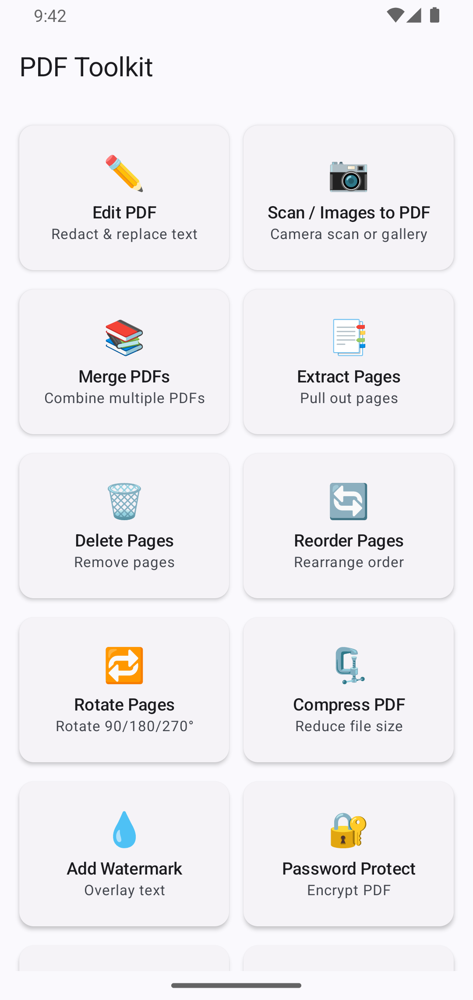</td>
    <td align="center"><b>Edit PDF</b><br/>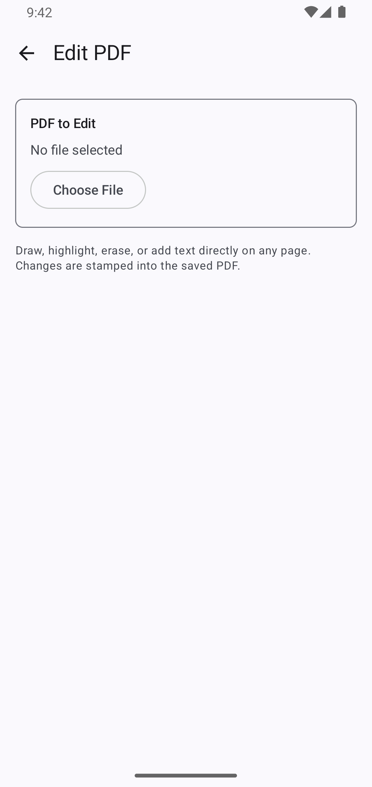</td>
    <td align="center"><b>Scan / Images to PDF</b><br/>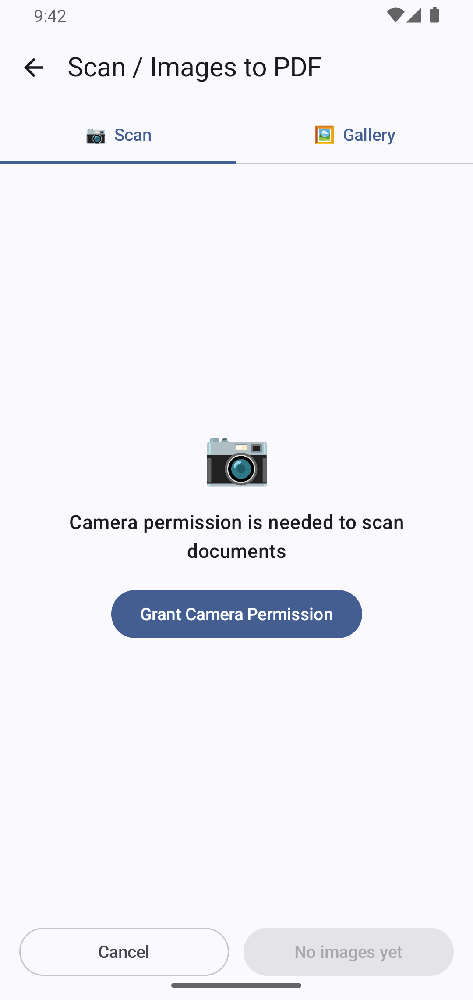</td>
    <td align="center"><b>Merge PDFs</b><br/>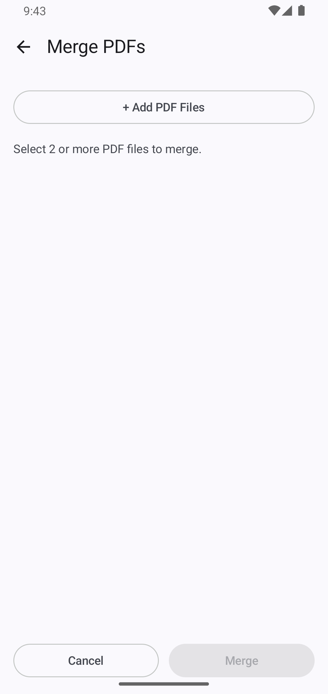</td>
  </tr>
  <tr>
    <td align="center"><b>Extract Pages</b><br/>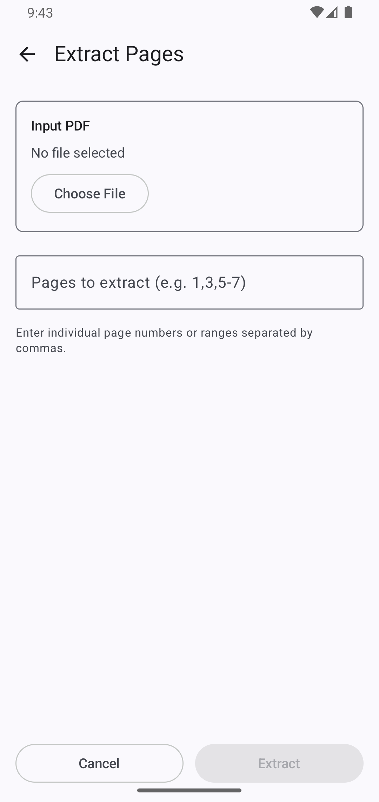</td>
    <td align="center"><b>Delete Pages</b><br/>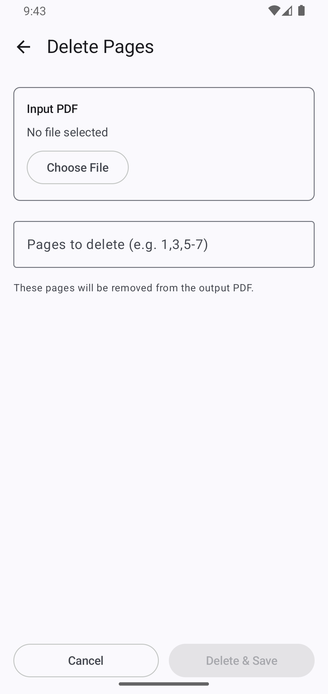</td>
    <td align="center"><b>Reorder Pages</b><br/>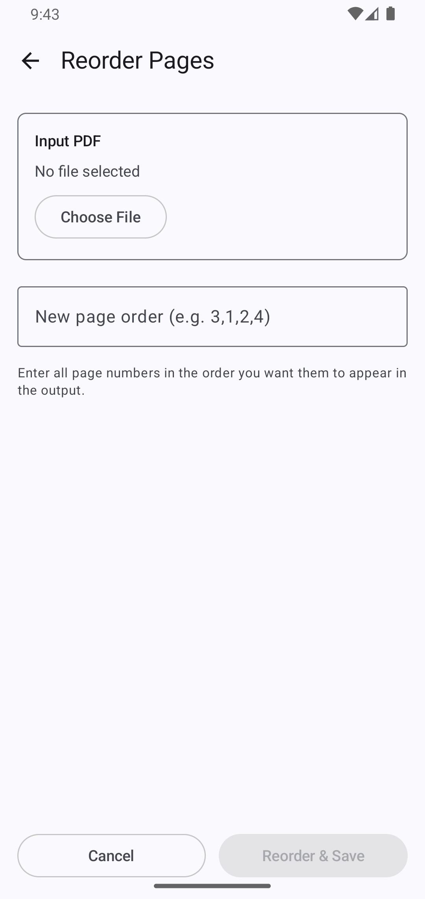</td>
    <td align="center"><b>Rotate Pages</b><br/>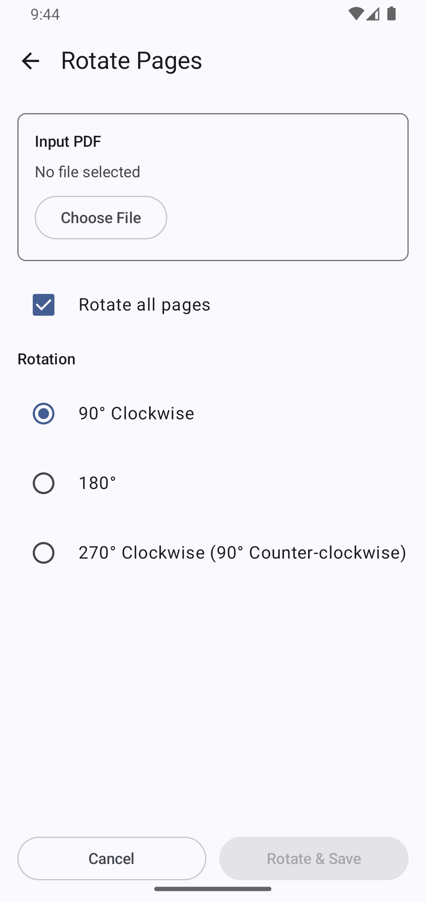</td>
  </tr>
  <tr>
    <td align="center"><b>Compress PDF</b><br/>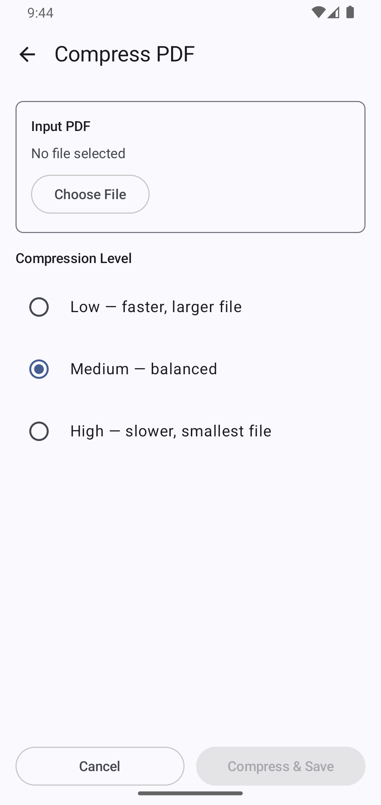</td>
    <td align="center"><b>Add Watermark</b><br/>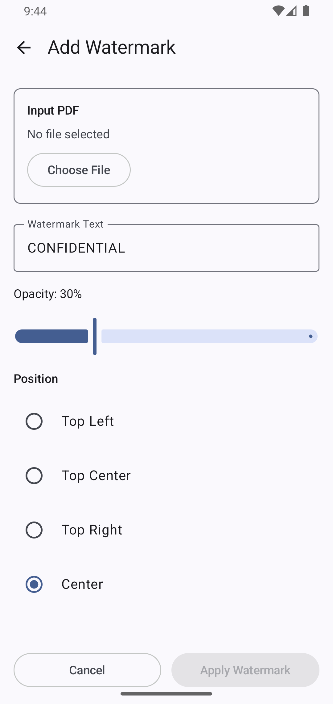</td>
    <td align="center"><b>Password Protect</b><br/>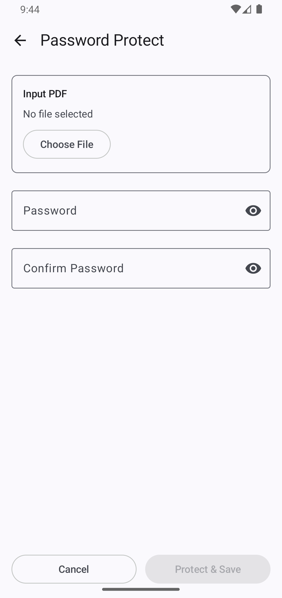</td>
    <td align="center"><b>Unlock PDF</b><br/>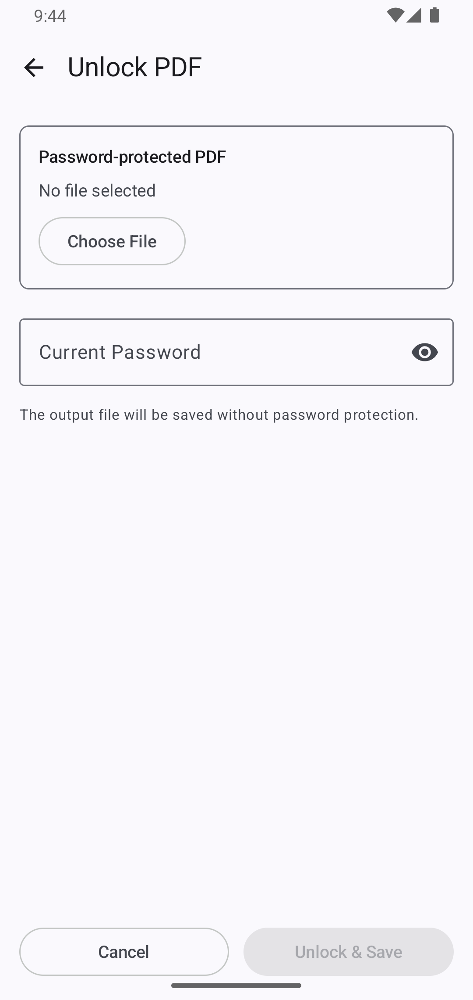</td>
  </tr>
  <tr>
    <td align="center"><b>Extract Text</b><br/>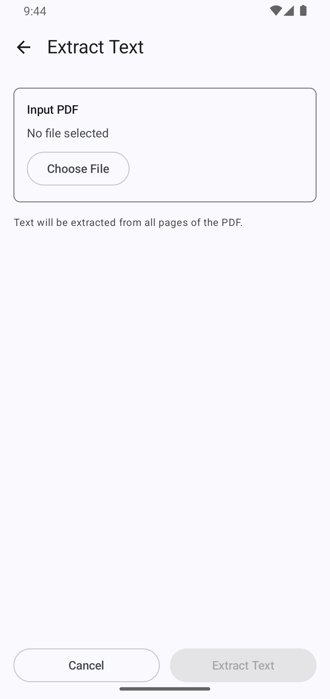</td>
  </tr>
</table>

---

## Architecture

```
app/
├── com.example.pdf_utility_app/       # UI layer
│   ├── ui/<feature>/                  # Screen + ViewModel per feature
│   ├── theme/                         # Material3 color, type, theme
│   ├── Navigation.kt                  # Navigation3 route graph
│   └── MainActivity.kt
│
└── com.offlinepdf.toolkit/            # Core domain + data layer
    ├── core/
    │   ├── domain/
    │   │   ├── model/                 # PdfDocument, WatermarkConfig, PasswordConfig, SplitMode, …
    │   │   ├── repository/            # PdfRepository, FileRepository interfaces
    │   │   └── usecase/pdf/           # One UseCase per operation
    │   └── data/
    │       ├── processor/
    │       │   ├── ITextPdfProcessor  # iText7 PDF engine
    │       │   └── AndroidPdfRenderer # Android PdfRenderer for page preview bitmaps
    │       ├── repository/            # PdfRepositoryImpl, FileRepositoryImpl
    │       └── source/                # PdfDataSource
    ├── di/                            # Hilt modules
    ├── worker/                        # WorkManager HiltWorker for background jobs
    └── update/                        # Firebase Remote Config update-check service
```

### Design patterns

- **Clean Architecture** — strict domain / data / UI separation
- **MVVM** — each screen has its own `ViewModel` exposing `StateFlow`
- **Use Cases** — one class per operation, composable and testable in isolation
- **Hilt DI** — constructor injection throughout; `@Singleton` scoped processors
- **WorkManager** — all heavy PDF operations run as `CoroutineWorker`, survive process death, and report progress back to the UI via `Flow<ProcessingProgress>`

---

## Tech Stack

| Layer | Library | Version |
|---|---|---|
| Language | Kotlin | 2.3.20 |
| UI | Jetpack Compose + Material3 | BOM latest |
| Navigation | Navigation3 | runtime + UI |
| DI | Hilt | 2.59.2 |
| Background | WorkManager + Hilt integration | 2.9.1 / 1.2.0 |
| PDF engine | iText7 (kernel, io, layout, forms) | 7.2.5 |
| Cryptography | BouncyCastle | 1.78.1 |
| Camera | CameraX (core, camera2, lifecycle, view) | 1.4.1 |
| Serialization | Kotlinx Serialization JSON | 1.7.1 |
| Analytics | Firebase Analytics | BOM 34.15.0 |
| Crash reporting | Firebase Crashlytics | BOM 34.15.0 |
| Remote config | Firebase Remote Config | BOM 34.15.0 |
| Build | AGP + KSP | latest |

---

## Feature Deep-Dive

### Edit PDF
A canvas-based editor rendered on top of iText7 page bitmaps. Supports:
- **Freehand drawing** with configurable stroke color and width
- **Text annotation** — tap to place a text box at any position
- **Redaction** — eraser tool using `BlendMode.Clear` to permanently black out content
- **Undo / Redo** per page
- Page-by-page navigation; edits are composited as PNG overlays and written back into the PDF

### Scan / Images to PDF
Two tabs in one screen:
- **Camera** — live CameraX preview with a capture button; captured frames are queued in a thumbnail row
- **Gallery** — multi-image picker via `ActivityResultContracts`

Images are scaled to fit A4 page dimensions and assembled into a PDF using iText7's `Document` API.

### Compress PDF
Images embedded in the PDF are re-encoded as JPEG at a reduced quality factor:

| Level | JPEG Quality |
|---|---|
| Low | 80% |
| Medium | 60% |
| High | 35% |

iText7 `SmartMode` is also applied to deduplicate redundant PDF objects, and document metadata is stripped to shrink the file further.

### Add Watermark
- **Text watermark** — custom text, font size, opacity (0–1), color (ARGB), rotation angle, 7 fixed positions (top-left → bottom-right)
- **Image watermark** — pick any image from gallery, set opacity and scale factor, choose position

### Password Protect
Applies AES-128 encryption via iText7 `WriterProperties.setStandardEncryption` with:
- Separate **user password** (open) and **owner password** (permissions)
- Configurable **allow printing** and **allow copying** permission flags

### Split PDF *(use-case layer)*
Three split strategies available at the domain layer:
- `ByRange` — explicit list of page ranges
- `EveryN` — chunk every N pages
- `AtPages` — split at specific page boundaries

### Firebase Remote Config — Force Update
`UpdateCheckService` fetches `version_name` and `force_update` from Remote Config on every app launch. If the remote version is higher than the installed version, a non-dismissable overlay is shown (Box with `pointerInput` consumption) directing the user to the Play Store. No network = silent pass-through.

---

## Requirements

- **Android 8.0+** (minSdk 26)
- **Target** Android 16 (SDK 36)
- Camera permission required only for the scan feature; all other features use the Storage/MediaStore picker

---

## Project Setup

1. Clone the repo  
   ```bash
   git clone https://github.com/Asad-noor/pdf-toolkit-android.git
   ```
2. Open in Android Studio Ladybug or newer
3. Add your `google-services.json` to `app/` (Firebase project required for Remote Config and Crashlytics)
4. Build & run on a device or emulator running API 26+

> The app runs fully without Firebase if `google-services.json` is absent — Remote Config silently falls back to defaults and Crashlytics is a no-op.

---

## License
Commercial use of this project code is not allowed
This project is for my portfolio and demonstration purposes.
